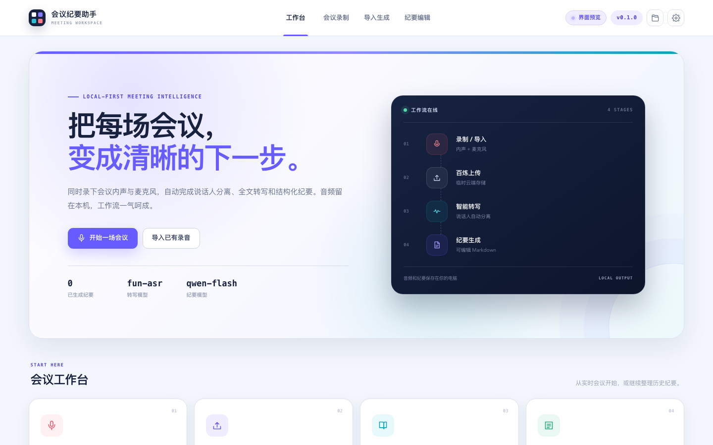
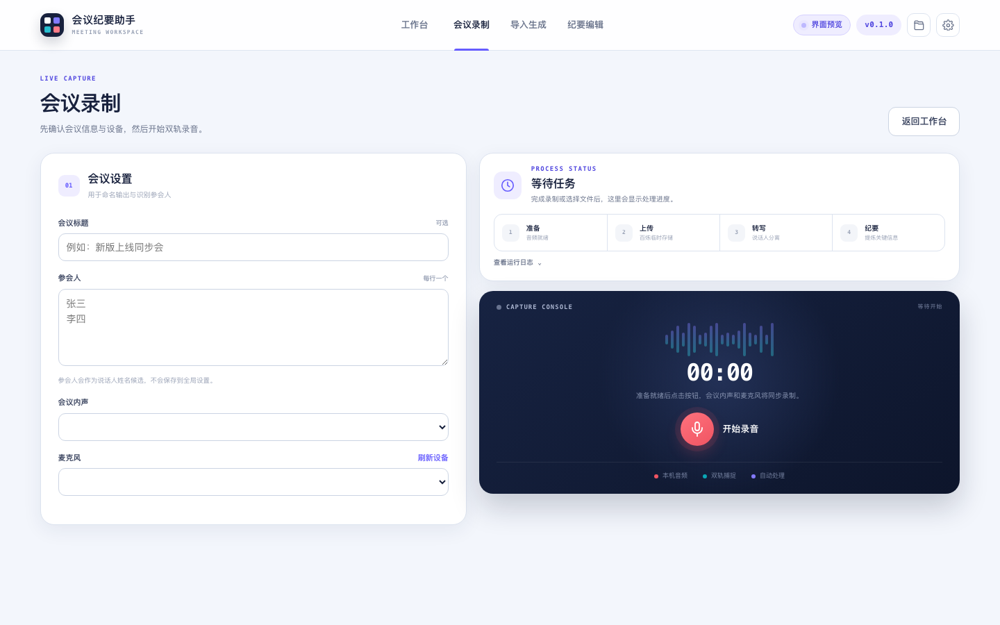
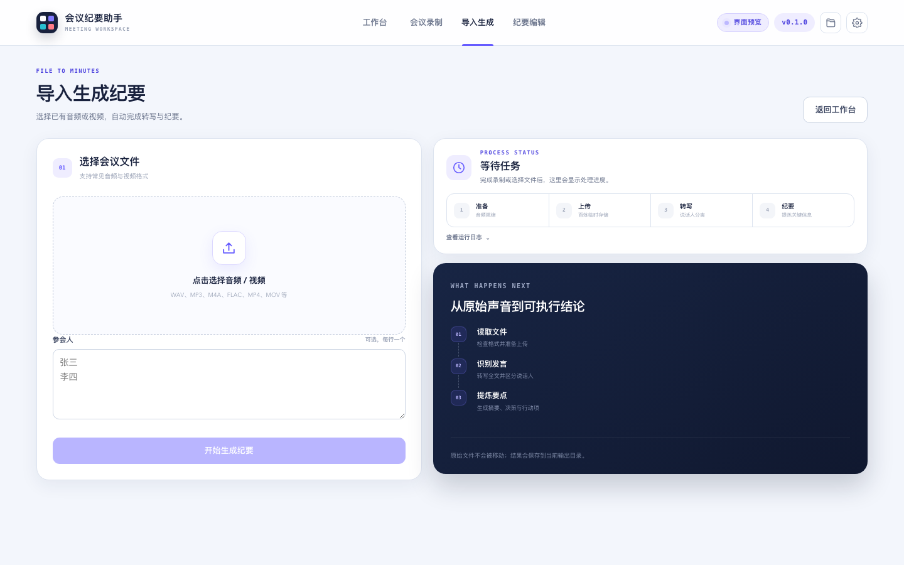
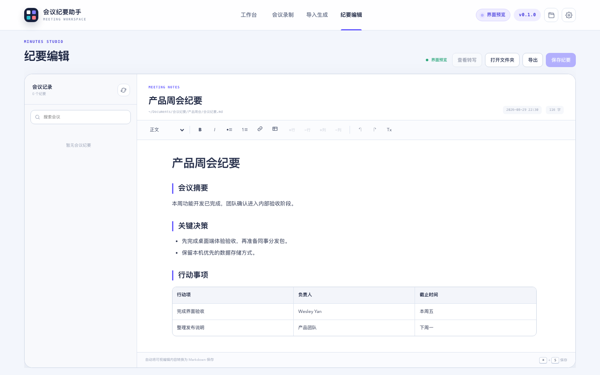

# Meeting Minutes Assistant

> 会议纪要助手：同步录制会议内声与麦克风，或导入已有音视频，自动完成说话人分离、全文转写和结构化会议纪要。

[](https://github.com/whisper2upp-max/Meeting-minutes-assistant/releases/latest)


<p align="center">
  
</p>

## 下载

前往 [Releases](https://github.com/whisper2upp-max/Meeting-minutes-assistant/releases/latest) 下载对应平台的 v0.1.6 安装包。

| 平台 | 发布文件 | 首次启动 |
| --- | --- | --- |
| macOS | `会议纪要助手-macOS.zip` | 解压后将 App 移入“应用程序”，首次右键选择“打开” |
| Windows | `会议纪要助手.exe` | 若 SmartScreen 提示，选择“更多信息 → 仍要运行” |

详细说明：[macOS 使用指南](docs/%E4%BD%BF%E7%94%A8%E8%AF%B4%E6%98%8E-macOS.md) · [Windows 使用指南](docs/%E4%BD%BF%E7%94%A8%E8%AF%B4%E6%98%8E-Windows.md)

## 它能做什么

- 在 macOS 和 Windows 上同步捕捉会议内声与麦克风。
- 导入 WAV、MP3、M4A、FLAC、MP4、MOV 等已有录音或视频。
- 使用百炼 `fun-asr` 转写，并自动区分说话人。
- 使用 `qwen-flash` 生成摘要、关键决策、行动事项和风险。
- 在应用内直接编辑 Markdown 纪要，包含标题、列表、引用和可增删行列的表格。
- 会后根据样例发言把“说话人1、2…”匹配为真实参会人，并同步更新转写和纪要标签。
- 会议音频、转写稿和纪要按会议分文件夹保存，支持断点续跑与历史管理。

## 一致的会议工作流

录制与导入使用相同的双栏网格和处理状态，切换页面时操作区不会横向跳动。

<table>
  <tr>
    <td width="50%"></td>
    <td width="50%"></td>
  </tr>
  <tr>
    <td align="center"><strong>会议录制</strong></td>
    <td align="center"><strong>导入生成</strong></td>
  </tr>
</table>

无论选择哪种入口，处理都依次经过：

1. 准备并混合单声道 16 kHz 音频。
2. 上传到已配置的百炼临时存储。
3. 转写全文并区分说话人。
4. 生成结构化纪要，进入内置编辑器复核。

## 纪要编辑

<p align="center">
  
</p>

编辑器会将可视内容序列化回 Markdown；导出文件可被常见 Markdown 阅读器正确渲染。点击“匹配参会人”可根据样例发言确认每个说话人的姓名，匹配结果按会议保存。历史列表支持搜索、滚动和删除整个会议文件夹；删除前会明确确认影响范围。

## 首次使用

1. 在阿里云百炼中创建 API Key。
2. 打开应用右上角“设置”，填入 API Key；使用专属网关时再填写 API 网关地址。
3. 选择“会议录制”或“导入生成”。
4. 处理完成后在“纪要编辑”中检查说话人、决策和行动事项。

macOS 首次录制时，应用会提示安装内置 BlackHole 2ch 驱动，并请求麦克风权限。Windows 使用 WASAPI loopback，无需另外安装内录驱动。

Windows v0.1.1 起使用系统证书库校验百炼 HTTPS 连接，兼容由公司统一下发并受 Windows 信任的企业根证书，无需导出证书或关闭安全校验。

Windows v0.1.2 修复 WASAPI 回环流启动参数不兼容问题；会议录制会直接读取默认输出设备对应的 PyAudioWPatch 回环输入。

Windows v0.1.3 修复结束录音时的原生音频流关闭竞态；录音改用 PyAudio 回调收集，先停止并关闭设备流，再排空写盘队列和关闭 WAV 文件。

Windows v0.1.4 修复默认麦克风可能录到静音的问题；设备列表现在只显示去重后的真实 WASAPI 输入，并按设备原生声道格式录制。

Windows v0.1.5 增加当前麦克风实时回听测试，并在默认选项中标出实际设备；同时修复自定义输出目录只能打开其 Documents 父级的问题。

Windows v0.1.6 恢复始终可见的系统默认麦克风项，将自动选择与固定设备分组；耳返改用稳定的实时读取链路并显示输入音量。纪要编辑器同时新增会后参会人匹配。

## 数据与隐私

- API Key 仅保存在用户目录下的 `~/.meetingkit/config.toml`，不会写入安装包。
- 会议文件默认保存在本机“文档/会议纪要”目录。
- 生成转写时，音频会上传到用户配置的百炼服务端点；原始导入文件不会被移动。
- 项目不提供示例密钥，也不应将真实密钥、本地配置或会议输出提交到 Git。

> 录制包含他人声音的会议前，请确认所在组织的政策允许，并事先告知参会者。

## 本地开发

```bash
git clone https://github.com/whisper2upp-max/Meeting-minutes-assistant.git
cd Meeting-minutes-assistant
python3 -m venv .venv
.venv/bin/pip install -r requirements.txt pytest pyinstaller
PYTHONPATH=src .venv/bin/python -m meetingkit
```

Windows PowerShell 中使用 `.venv\Scripts\python.exe`，并将 `PYTHONPATH` 设为 `src`。

运行测试：

```bash
PYTHONPATH=src .venv/bin/python -m pytest
```

本地打包：

```bash
scripts/build_macos.sh
scripts/build_windows.bat
```

GitHub Actions 会在 `main` 分支更新时构建 macOS 和 Windows 产物。

## 项目结构

```text
src/meetingkit/
├── audio/       # macOS BlackHole / Windows WASAPI 录音与混音
├── cloud/       # 百炼转写与纪要生成
├── gui/         # Tkinter 备用界面
├── webui/       # pywebview + HTML/CSS/JavaScript 主界面
├── config.py    # 本机配置
├── pipeline.py  # 音频 → 转写 → 纪要
└── prompt.py    # 结构化纪要提示词
```

版本记录见 [CHANGELOG.md](CHANGELOG.md)。项目由 [@whisper2upp-max](https://github.com/whisper2upp-max) 维护。
